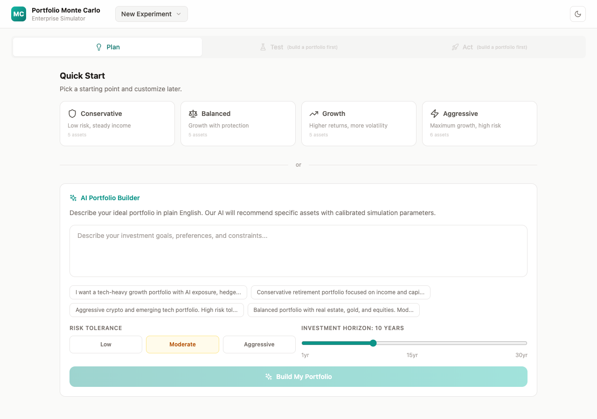
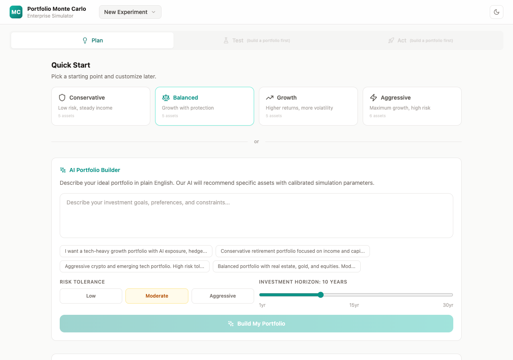
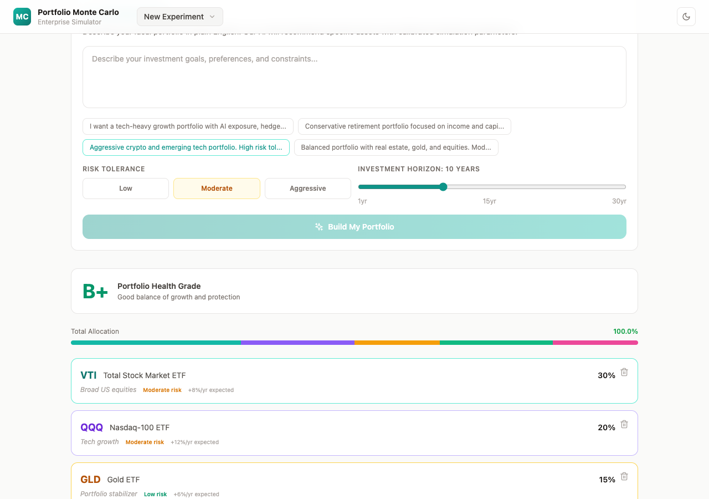
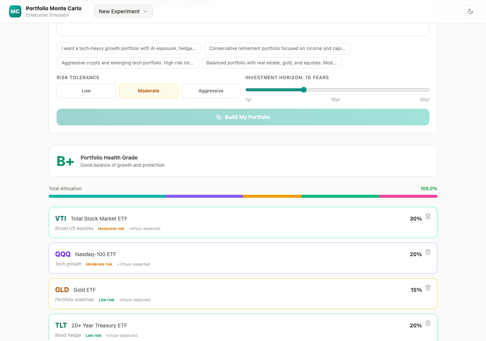
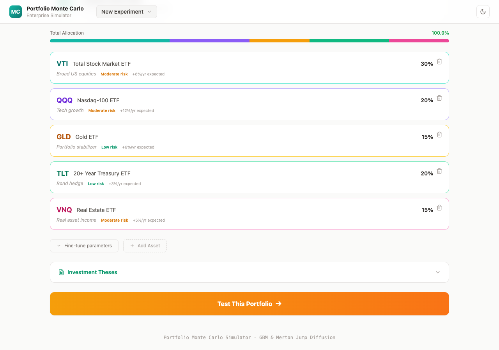
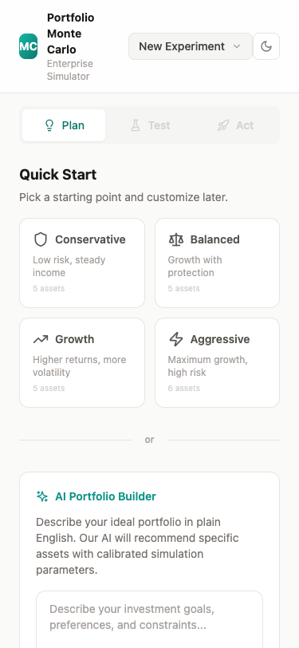
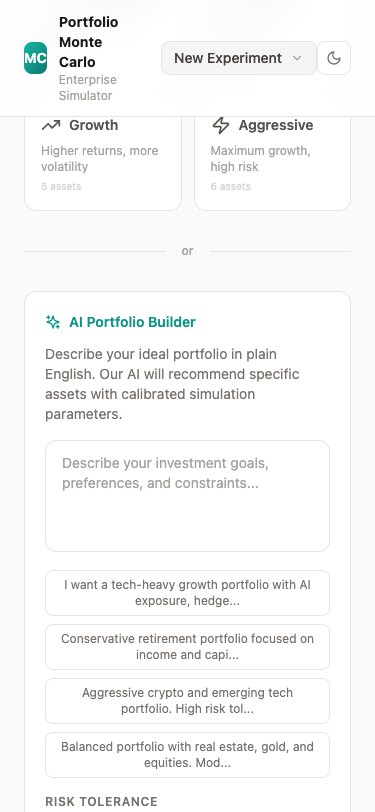
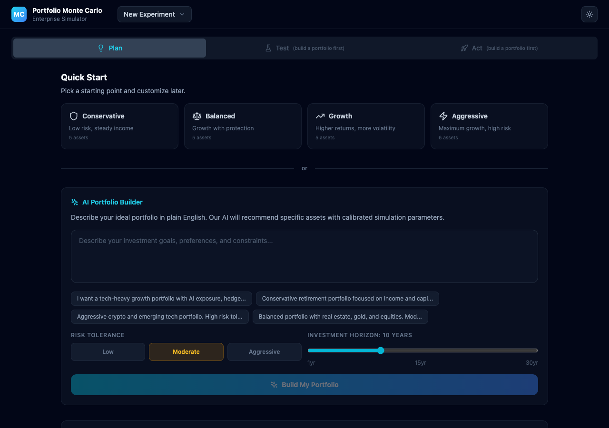

# Portfolio Monte Carlo Simulator

> Describe a portfolio in plain English. Simulate it. Stress-test it. Optimize the weights. Execute the trades.

An open-source portfolio simulation platform built on Monte Carlo methods (GBM and Merton Jump Diffusion) with a tab-based workspace that auto-saves experiments.

<br>

## Why This Exists

Tools for each piece of the investment workflow already exist. None connect them.

| | NLP to Portfolio | Monte Carlo Sim | Crisis Backtest | Weight Optimizer | Trade Execution | Open Source |
|---|:---:|:---:|:---:|:---:|:---:|:---:|
| **This project** | **Yes** | **Yes** | **Yes** | **Yes** | **Yes** | **Yes** |
| [Composer](https://www.composer.trade/) | Yes | — | Yes | — | Yes | No |
| [StressTest.pro](https://stresstest.pro/) | — | Yes | Yes | Yes | — | No |
| [Portfolio Visualizer](https://www.portfoliovisualizer.com/) | — | Yes | Yes | Yes | — | No |
| [PortfolioPilot](https://portfoliopilot.com/) | Yes | — | — | — | Partial | No |

Every competitor is closed-source and covers 2-3 of these capabilities. This is the only platform that runs the **entire pipeline** — from natural language description to executed trades — in one open-source workspace.

**What makes it different:**

- **Full pipeline, connected** — optimize weights and apply them back to the portfolio with one click. Backtest a crisis and forward-simulate the same portfolio instantly. Execute what you just simulated.
- **Open source, self-hostable** — no vendor lock-in. Fork it. Extend it. Deploy on your own infrastructure.
- **Enterprise architecture** — bounded contexts, provider abstraction for brokers, built-in observability with funnel analytics, OTEL-exportable telemetry. Designed for teams, not just individuals.
- **Experiment management** — save, compare, duplicate, restore portfolio experiments. Every competitor treats each session as disposable.

**Capabilities no competitor has:**

- **Portfolio DNA** — 8-dimensional fingerprint (growth, volatility, tail risk, diversification, concentration, defensive tilt, momentum, crisis resilience) with AI personality summary. Compare portfolio "personalities" across experiments.
- **Investment Thesis Tracker** — structured rationale per asset (narrative, assumptions, risk factors, invalidation triggers). AI generates theses, then critiques them against your simulation results. Status badges: valid / weakening / invalidated.
- **Custom Scenario Builder** — describe a hypothetical crisis in natural language ("inflation hits 8%, tech earnings drop 40%"). AI calibrates drift, volatility, jump, and correlation parameters. Runs through the same backtest engine as historical crises.
- **Regime-Aware Simulation** — Markov chain switching between bull, bear, crisis, and recovery regimes during simulation. Each regime applies different drift/volatility/jump multipliers. No more flat-line assumptions.
- **Collaborative Experiments** — publish experiments, browse a community feed, fork others' portfolios, compare by Sharpe/return/drawdown.

<br>

## Screenshots

### Plan — Quick Start Presets + AI Portfolio Builder

Pick a preset or describe your goals. AI builds the portfolio.



Portfolio output with health grade, human-readable risk labels, and asset rationale.




### Test — Simulate, Optimize, Stress-Test (One Page)

Run simulations, optimize weights, and test against crises — all inline, no tab-hopping.





### Act — Execute Trades + Community

Connect a broker, execute, and discover community portfolios.


### Mobile

Fully responsive. 2x2 preset grids, stacked layouts, scrollable portfolio bar.




### Dark Mode



<br>

---

<br>

## Three Phases. One Workspace.

| Phase | What it does |
|-------|-------------|
| **Plan** | Pick a preset or describe goals in natural language. AI builds a portfolio with calibrated parameters. Portfolio health grade. Investment theses. |
| **Test** | Simulate (standard, crash modeling, or dynamic conditions). Inline optimizer ("Can it be better?"). Inline crisis backtest ("What if 2008 happened?"). Portfolio grade. All on one page. |
| **Act** | Connect Alpaca via OAuth. Generate trade list. Execute. Browse community portfolios. Fork others' experiments. |

A persistent **portfolio bar** shows current allocations across all tabs. Switching tabs never destroys state.

**Portfolio experiments** auto-save to IndexedDB. Create, duplicate, rename, delete. Restored on reload.

<br>

---

<br>

## Quick Start

```bash
# Backend
cd backend
pip install -r requirements.txt       # or: poetry install
echo 'GEMINI_API_KEY=your-key' > .env  # optional — falls back to curated portfolios
uvicorn app.main:app --reload --port 8000

# Frontend
cd frontend
npm install && npm run dev
```

Open **http://localhost:5173**. API docs at **http://localhost:8000/docs**.

<br>

---

<br>

## Architecture

```
Frontend (React 18 / TypeScript / Vite / Tailwind / Recharts)
  ├── Workspace: Build | Simulate | Backtest | Optimize | Execute
  ├── Portfolio Experiments: IndexedDB persistence
  └── Telemetry: sendBeacon → backend

Backend (Python 3.12 / FastAPI / single container)
  ├── contexts/intake/         Gemini AI portfolio analysis
  ├── contexts/simulation/     Monte Carlo engine, optimizer, backtest
  ├── contexts/insights/       AI narrative generation
  ├── contexts/dna/            Portfolio DNA fingerprint (8 dimensions)
  ├── contexts/thesis/         Investment thesis generation + AI critique
  ├── contexts/scenarios/      Custom scenario calibration + execution
  ├── contexts/community/      Publish, feed, fork experiments
  ├── contexts/fulfill/        Brokerage OAuth, trade list, execution
  │   └── providers/           BrokerProvider ABC → Alpaca adapter
  ├── contexts/observability/  Request tracing, journey analytics
  └── engine/                  GBM, Merton, Regime-Switching, Cholesky
```

Ten bounded contexts. One container. Scale by cloning. Every context works headless via REST — use any piece independently.

<br>

---

<br>

## Mathematical Models

**Geometric Brownian Motion**

```
S(t+dt) = S(t) * exp((mu - sigma^2/2) * dt + sigma * sqrt(dt) * Z)
```

**Merton Jump Diffusion**

```
dS/S = (mu - lambda*k)dt + sigma*dW + J*dN
```

Poisson jump arrivals. Log-normal jump sizes. Compensation term `k = exp(mu_J + sigma_J^2/2) - 1`.

**Regime-Switching Simulation**

4 regimes (bull, bear, crisis, recovery) with Markov chain transitions. Each regime applies drift/volatility/jump multipliers to the underlying GBM+jump process. Transition probabilities calibrated from historical regime durations.

**Correlation** — Cholesky decomposition of the NxN correlation matrix for correlated Brownian motions.

**Risk metrics** — VaR (95/99%), CVaR, Sharpe, Sortino, Calmar, Max Drawdown.

<br>

---

<br>

## Brokerage Integration

| Feature | Detail |
|---------|--------|
| **Providers** | Alpaca (live). IBKR (planned). Add a new broker = 1 file + 1 registry line. |
| **Auth** | OAuth flow. Tokens encrypted at rest (Fernet + SQLite). Never sent to frontend. |
| **Trade list** | Target allocations vs current holdings. Buy/sell/hold with share quantities. |
| **Safety** | Default paper mode. Server-side `confirm: true` gate. PAPER/LIVE visual indicators. |

<br>

---

<br>

## Observability

Built-in request tracing + user journey analytics. Stored in SQLite, queryable via REST.

| Endpoint | What you learn |
|----------|---------------|
| `GET /api/obs/funnel` | Where users drop off |
| `GET /api/obs/timing` | P50 / P95 / P99 latency per endpoint |
| `GET /api/obs/journey/:session` | Full event timeline for one user |
| `GET /api/obs/bottlenecks` | Slowest endpoints by P95 |
| `GET /api/obs/drop-offs` | Highest abandonment rates |

Set `OTEL_EXPORTER_ENDPOINT` to ship to Jaeger, Grafana Tempo, or Datadog.

<br>

---

<br>

## Environment Variables

| Variable | Default | Purpose |
|----------|---------|---------|
| `GEMINI_API_KEY` | — | Gemini AI. Falls back to curated portfolios if unset. |
| `ALPACA_CLIENT_ID` | — | Alpaca OAuth client ID |
| `ALPACA_CLIENT_SECRET` | — | Alpaca OAuth client secret |
| `DEFAULT_TRADING_MODE` | `paper` | `paper` or `live` |
| `TOKEN_ENCRYPTION_KEY` | auto-gen | Fernet key for token encryption |
| `OTEL_EXPORTER_ENDPOINT` | — | OTLP collector for external telemetry |
| `VITE_API_URL` | `localhost:8000` | Backend URL (frontend) |

<br>

---

<br>

## Tech Stack

| Layer | Stack |
|-------|-------|
| **Frontend** | React 18, TypeScript, Vite, Tailwind CSS, Recharts, Lucide |
| **Backend** | Python 3.12, FastAPI, NumPy, SciPy, Pydantic |
| **AI** | Google Gemini (analysis + narratives) |
| **Brokerage** | httpx, cryptography (Fernet) |
| **Observability** | OpenTelemetry, SQLite |
| **Storage** | IndexedDB (frontend), SQLite (backend) |

<br>

---

<br>

## License

MIT
