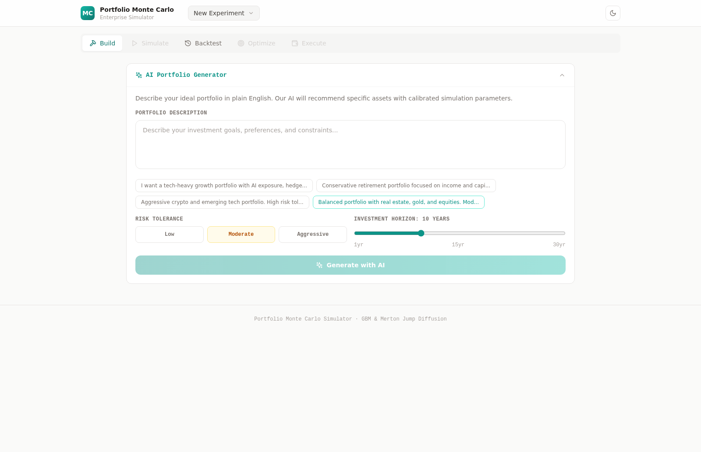
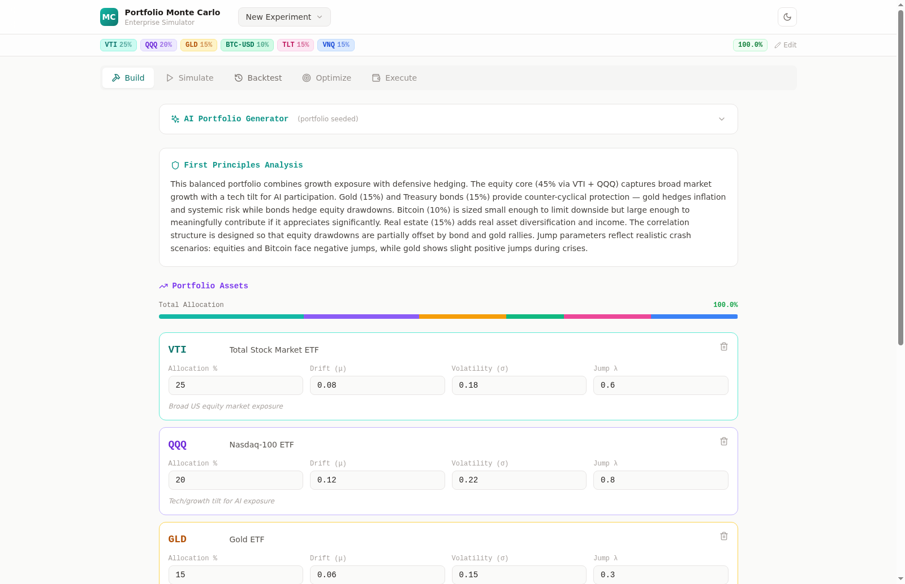
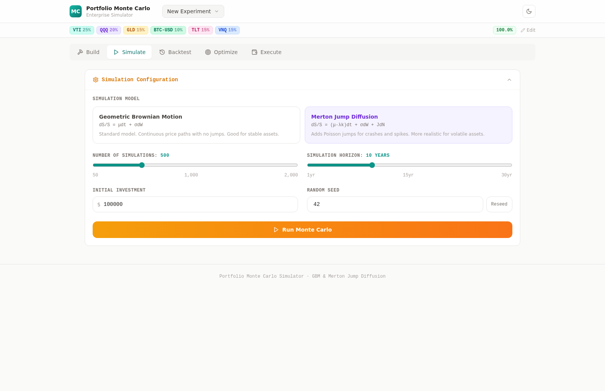
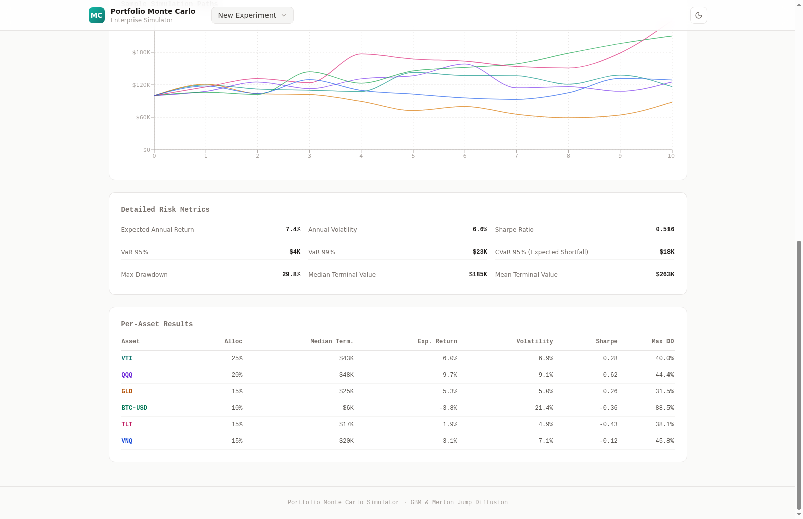
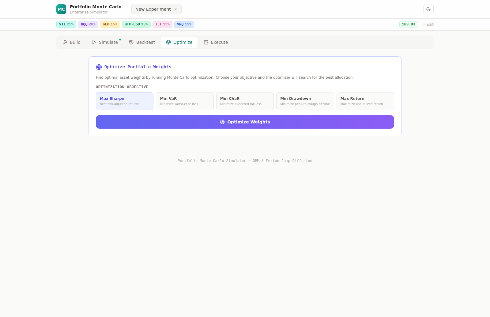
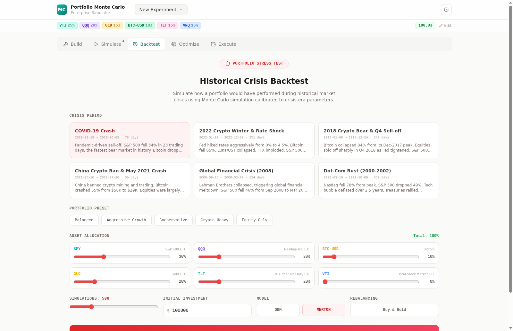
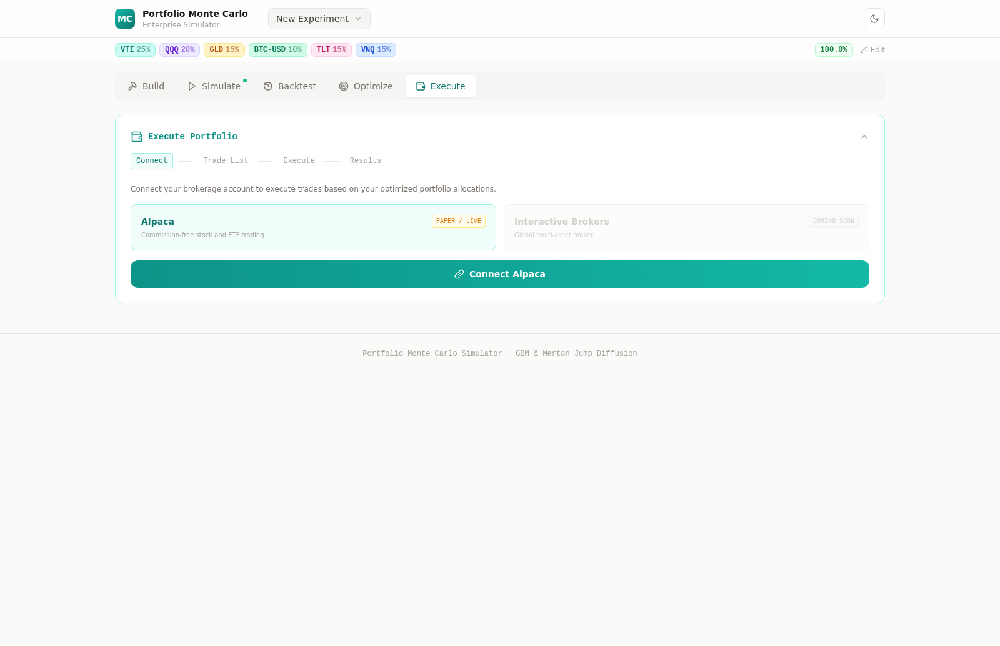

# Portfolio Monte Carlo Simulator

An enterprise-grade portfolio simulation platform that combines **AI-powered analysis** with **Monte Carlo methods** (GBM and Merton Jump Diffusion) to model portfolio outcomes across thousands of stochastic paths.

Users describe a portfolio in plain English, review AI-recommended assets with calibrated parameters, run simulations, optimize weights, stress-test against historical crises, and execute trades through connected brokerages — all within a non-linear workspace that auto-saves experiments to IndexedDB.

The platform also includes a **Historical Crisis Stress Test** mode that backtests portfolios against 6 major market crises using crisis-calibrated simulation parameters.

---

## Screenshots

### Build — AI Portfolio Generator
Describe your investment goals in natural language. Select risk tolerance and investment horizon. Choose from preset prompts or write your own. AI recommends specific assets with calibrated drift, volatility, and jump parameters. Edit allocations, add/remove assets, and review the first-principles rationale.




### Simulate — Monte Carlo Engine
Choose between Geometric Brownian Motion and Merton Jump Diffusion models. Set number of simulations (50–2,000), horizon (1–30 years), initial investment, and random seed. View results with key metrics (median terminal value, VaR, Sharpe ratio, max drawdown), percentile fan chart, sample paths, detailed risk metrics, and per-asset breakdown.





### Optimize — Portfolio Weight Optimizer
Run SLSQP-based optimization with 5 objectives: Max Sharpe, Min VaR, Min CVaR, Min Drawdown, or Max Return. Compare original vs optimized weights and apply with one click.



### Backtest — Historical Crisis Stress Test
Backtest any portfolio against 6 historical market crises (COVID-19, 2022 Crypto Winter, 2018 Bear Market, China Ban 2021, GFC 2008, Dot-Com Bust). Configure asset allocations with presets and run Monte Carlo simulation calibrated to crisis-era parameters.



### Execute — Brokerage Integration
Connect your brokerage account (Alpaca supported, IBKR coming soon) via OAuth. Generate trade lists from target allocations vs current holdings and execute with one click. Paper and live trading modes with safety gates.



---

## Architecture

The backend is organized into **bounded context modules** — logically separated services running in a single container. Each context has its own router and can be extracted to a standalone service when scaling demands it.

```
┌─────────────────────────────────────────────────────────────┐
│  React Frontend (TypeScript + Tailwind + Recharts)          │
│  Workspace: Build | Simulate | Backtest | Optimize | Execute│
│  Portfolio Experiments: auto-saved to IndexedDB             │
│  Telemetry: sendBeacon → /api/obs/event                     │
└───────────────────────────┬─────────────────────────────────┘
                            │ HTTP (JSON)
                            ▼
┌─────────────────────────────────────────────────────────────┐
│  FastAPI Backend (single container, scale by cloning)       │
│                                                             │
│  Bounded Contexts:                                          │
│  ┌──────────┐ ┌──────────┐ ┌──────────┐ ┌──────────┐      │
│  │ Intake   │ │Portfolio │ │Simulation│ │ Insights │      │
│  │          │ │          │ │          │ │          │      │
│  │ Gemini   │ │ CRUD     │ │ MC sim   │ │ AI       │      │
│  │ NLP→     │ │ presets  │ │ optimizer│ │ narrative│      │
│  │ assets   │ │ versions │ │ backtest │ │ critique │      │
│  └──────────┘ └──────────┘ └──────────┘ └──────────┘      │
│  ┌──────────┐ ┌─────────────────────────────────────┐      │
│  │ Fulfill  │ │ Observability (cross-cutting)       │      │
│  │          │ │ Request tracing → SQLite             │      │
│  │ broker   │ │ Journey events → funnel, drop-offs   │      │
│  │ trades   │ │ /api/obs/* query endpoints           │      │
│  │ execute  │ │                                      │      │
│  └──────────┘ └─────────────────────────────────────┘      │
│                                                             │
│  Shared: engine/monte_carlo.py (GBM, Merton, Cholesky)     │
│  NumPy + SciPy + google-genai                               │
└─────────────────────────────────────────────────────────────┘
```

**Backend** — Python 3.12 / FastAPI. Six bounded contexts: intake (Gemini AI analysis), portfolio (persistence), simulation (Monte Carlo + optimizer + backtest), insights (AI narratives), fulfill (export/reports), and observability (request tracing + user journey analytics). All run in a single container; scale horizontally by cloning.

**Frontend** — React 18 / TypeScript / Vite. Tab-based workspace (Build, Simulate, Backtest, Optimize, Execute) with a persistent portfolio bar and experiment management. Portfolio experiments auto-saved to IndexedDB and restored on reload. Light/dark theme toggle. Frontend telemetry via `sendBeacon`. Interactive Recharts visualizations built with Tailwind CSS.

---

## Key Features

- **Natural Language Portfolio Builder** — describe your portfolio in plain English; AI recommends assets with calibrated parameters
- **Geometric Brownian Motion (GBM)** — `S(t+dt) = S(t) * exp((mu - sigma^2/2)*dt + sigma*sqrt(dt)*Z)`
- **Merton Jump Diffusion** — `dS/S = (mu - lambda*k)dt + sigma*dW + J*dN` with Poisson jumps and log-normal jump sizes
- **Cholesky-Decomposed Correlation** — correlated Brownian motions across all assets via Cholesky factorization
- **Comprehensive Risk Metrics** — VaR (95%, 99%), CVaR (Expected Shortfall), Sharpe Ratio, Max Drawdown
- **Percentile Fan Charts** — P10, P25, Median, P75, P90 bands at annual intervals from monthly time steps
- **Per-Asset Breakdown** — individual asset results with allocation, terminal value, return, volatility, and drawdown
- **Configurable Parameters** — number of simulations, horizon, model type, initial investment, random seed
- **Editable Asset Allocations** — adjust drift, volatility, jump intensity, and allocation percentages before simulation
- **AI Fallback System** — 3 curated portfolio templates when Gemini API is unavailable
- **Portfolio Weight Optimizer** — SLSQP-based optimization for Sharpe, min variance, min CVaR, min max drawdown, or max return
- **Historical Crisis Stress Test** — backtest portfolios against 6 major market crises with calibrated parameters
- **6 Crisis Periods** — COVID-19 Crash, 2022 Crypto Winter, 2018 Bear Market, China Ban 2021, GFC 2008, Dot-Com Bust
- **Crisis-Calibrated Parameters** — per-asset drift, volatility, jump intensity, and correlation overrides matched to historical behavior
- **Backtest Analytics** — equity curve with confidence bands, drawdown analysis, per-asset breakdown, sample paths, returns histogram, Sharpe/Sortino/Calmar ratios, VaR, recovery time
- **Portfolio Presets** — Balanced, Aggressive Growth, Conservative, Crypto Heavy, Equity Only
- **Brokerage Integration** — connect Alpaca (or IBKR) via OAuth, generate trade lists from target allocations vs current holdings, and execute with one click
- **Provider Abstraction** — clean `BrokerProvider` interface for adding new brokers (one file + one registry line)
- **Trade Safety** — default paper trading mode, server-side `confirm` gate, encrypted token storage, PAPER/LIVE visual indicators
- **Observability** — automatic request tracing, user journey event tracking, funnel analytics, drop-off detection, bottleneck identification
- **Light/Dark Theme** — toggle between themes with localStorage persistence
- **Workspace Navigation** — 5-tab hub-and-spoke UI (Build, Simulate, Backtest, Optimize, Execute) replacing the linear wizard
- **Portfolio Experiments** — named, auto-saved experiments with IndexedDB persistence, duplicate/rename/delete
- **Cross-Tab Data Flow** — optimizer can apply weights back to portfolio, backtest can feed into forward sim
- **Bounded Context Architecture** — modular backend ready for microservice extraction

---

## Dependencies

### Backend (Python 3.12)

| Package | Version | Purpose |
|---------|---------|---------|
| `fastapi[standard]` | ^0.135.2 | Web framework with Uvicorn |
| `numpy` | ^2.4.3 | Monte Carlo simulation engine |
| `scipy` | ^1.17.1 | Statistical functions, Cholesky decomposition |
| `pydantic` | ^2.12.5 | Request/response validation |
| `google-genai` | ^1.68.0 | Gemini AI portfolio analysis |

### Frontend (Node.js)

| Package | Version | Purpose |
|---------|---------|---------|
| `react` | ^18.3.1 | UI framework |
| `react-dom` | ^18.3.1 | React DOM renderer |
| `typescript` | ~5.6.2 | Type safety |
| `vite` | ^6.0.1 | Build tool and dev server |
| `tailwindcss` | ^3.4.16 | Utility-first CSS |
| `recharts` | ^2.12.4 | Charts (fan chart, line chart) |
| `lucide-react` | ^0.364.0 | Icons |
| `class-variance-authority` | ^0.7.1 | Component variants |
| `clsx` | ^2.1.1 | Conditional classnames |
| `tailwind-merge` | ^3.5.0 | Tailwind class merging |

---

## Getting Started

### Quick Start (Docker)

```bash
cp .env.example .env          # edit .env to add GEMINI_API_KEY (optional)
docker compose up --build
# Backend:  http://localhost:8000  (API docs at /docs)
# Frontend: http://localhost:8080
```

No GCP credentials needed for local dev. `GEMINI_API_KEY` is optional — the app falls back to curated portfolios if unset.

### Prerequisites (without Docker)

- Python 3.12+
- [Poetry](https://python-poetry.org/docs/#installation) (Python package manager)
- Node.js 18+ and npm

### Backend Setup

```bash
cd backend

# Install dependencies
poetry install

# (Optional) Set Gemini API key for AI analysis
# Without it, the app uses curated fallback portfolios
echo 'GEMINI_API_KEY=your-google-gemini-api-key' > .env

# Start the backend server
poetry run uvicorn app.main:app --reload --port 8000
```

The API will be available at `http://localhost:8000`. API docs at `http://localhost:8000/docs`.

### Frontend Setup

```bash
cd frontend

# Install dependencies
npm install

# Start the dev server
npm run dev
```

The app will be available at `http://localhost:5173`.

### Environment Variables

| Variable | Location | Default | Description |
|----------|----------|---------|-------------|
| `GEMINI_API_KEY` | Backend `.env` | (none) | Google Gemini API key. Falls back to curated portfolios if unset |
| `VITE_API_URL` | Frontend | `http://localhost:8000` | Backend API URL |
| `ALPACA_CLIENT_ID` | Backend `.env` | (none) | Alpaca OAuth client ID (from https://app.alpaca.markets/brokerage/apps) |
| `ALPACA_CLIENT_SECRET` | Backend `.env` | (none) | Alpaca OAuth client secret |
| `DEFAULT_TRADING_MODE` | Backend `.env` | `paper` | `paper` for sandbox, `live` for real money |
| `TOKEN_ENCRYPTION_KEY` | Backend `.env` | (auto-gen) | Fernet key for encrypting stored OAuth tokens |
| `OTEL_EXPORTER_ENDPOINT` | Backend `.env` | (none) | OTLP collector endpoint. When set, telemetry exports via gRPC instead of local SQLite |

---

## Deployment

### Firebase Hosting (Frontend) + Cloud Run (Backend)

**Frontend:**
```bash
cd frontend
npm run build
firebase init hosting  # public dir: dist, SPA: Yes
firebase deploy
```

**Backend:**
```bash
cd backend
gcloud run deploy portfolio-mc-api \
  --source . \
  --region us-central1 \
  --allow-unauthenticated \
  --set-env-vars GEMINI_API_KEY=your-key
```

Update the frontend's `VITE_API_URL` to point to your Cloud Run URL before building.

---

## Project Structure

```
ai-disruption-mc/
├── backend/
│   ├── app/
│   │   ├── main.py                          # FastAPI app, middleware, router mounts
│   │   ├── contexts/                        # Bounded context modules
│   │   │   ├── intake/
│   │   │   │   └── router.py                # POST /api/analyze-portfolio
│   │   │   ├── portfolio/
│   │   │   │   └── router.py                # CRUD endpoints (placeholder)
│   │   │   ├── simulation/
│   │   │   │   └── router.py                # /api/simulate, /optimize-weights, /backtest
│   │   │   ├── insights/
│   │   │   │   ├── narrator.py              # AI narrative generation (Gemini)
│   │   │   │   └── router.py                # Explain endpoints (placeholder)
│   │   │   ├── fulfill/
│   │   │   │   ├── router.py                # OAuth, trade list, execute, order status
│   │   │   │   ├── schemas.py               # Fulfill-specific Pydantic models
│   │   │   │   ├── trade_generator.py       # Target vs current → buy/sell list
│   │   │   │   ├── token_store.py           # Encrypted OAuth token storage (Fernet + SQLite)
│   │   │   │   └── providers/
│   │   │   │       ├── base.py              # BrokerProvider ABC
│   │   │   │       └── alpaca.py            # Alpaca REST API adapter
│   │   │   └── observability/
│   │   │       ├── middleware.py             # Request tracing middleware
│   │   │       ├── journey.py               # Event emitter + SQLite store
│   │   │       └── router.py                # /api/obs/* query endpoints
│   │   ├── engine/                          # Shared compute library
│   │   │   ├── analyzer.py                  # Gemini AI portfolio analyzer
│   │   │   ├── backtest.py                  # Crisis backtest engine
│   │   │   ├── monte_carlo.py               # GBM, Merton, risk metrics
│   │   │   └── optimizer.py                 # SLSQP weight optimizer
│   │   └── models/
│   │       └── schemas.py                   # Pydantic models
│   ├── pyproject.toml
│   └── .env                                 # GEMINI_API_KEY (gitignored)
├── frontend/
│   ├── src/
│   │   ├── App.tsx                          # Workspace shell + experiment management
│   │   ├── api.ts                           # API client (sends X-Session-ID)
│   │   ├── telemetry.ts                     # Frontend event tracker (sendBeacon)
│   │   ├── store/
│   │   │   ├── experiments.ts               # IndexedDB wrapper for portfolio experiments
│   │   │   └── useExperiment.ts             # React hook for experiment state
│   │   ├── types/
│   │   │   ├── portfolio.ts                 # Core types + PortfolioExperiment
│   │   │   └── fulfill.ts                   # Brokerage/trade interfaces
│   │   └── components/
│   │       ├── WorkspaceTabs.tsx             # 5-tab navigation bar
│   │       ├── PortfolioBar.tsx              # Always-visible portfolio summary strip
│   │       ├── BuildTab.tsx                  # AI describe + asset editor (merged)
│   │       ├── SimulateTab.tsx               # Config + results dashboard (merged)
│   │       ├── OptimizeTab.tsx               # Weight optimization with "Apply" button
│   │       ├── BacktestTab.tsx               # Crisis stress test
│   │       ├── ExecuteTab.tsx                # Broker connect + trade execution
│   │       ├── BacktestPanel.tsx             # Backtest internals
│   │       ├── FulfillPanel.tsx              # Fulfill internals
│   │       └── ThemeProvider.tsx             # Light/dark theme context
│   ├── package.json
│   └── tailwind.config.js
├── docs/                                    # Screenshots
└── README.md
```

---

## Observability

The platform includes built-in observability for monitoring user journeys and system performance. All telemetry is stored locally in SQLite (`telemetry.db`) and queryable via REST endpoints.

### Query Endpoints

| Endpoint | Description |
|----------|-------------|
| `GET /api/obs/funnel?hours=24` | Step completion rates across bounded contexts |
| `GET /api/obs/timing?hours=24` | P50/P95/P99 latency per API endpoint |
| `GET /api/obs/journey/:session` | Full event timeline for a specific user session |
| `GET /api/obs/errors?hours=24` | Recent errors grouped by context and endpoint |
| `GET /api/obs/bottlenecks` | Top 10 slowest endpoints by P95 latency |
| `GET /api/obs/drop-offs?hours=24` | Steps with highest user abandonment rates |
| `POST /api/obs/event` | Frontend event sink (receives telemetry via sendBeacon) |

### How It Works

- **Request tracing**: Every API request is automatically timed and recorded by the observability middleware
- **Journey events**: Backend contexts emit `step_completed` events with session IDs; frontend emits step transitions via `sendBeacon`
- **Session correlation**: Frontend sends `X-Session-ID` header on all API calls, linking backend traces to frontend events
- **Export-ready**: Set `OTEL_EXPORTER_ENDPOINT` to ship telemetry to an external OpenTelemetry collector (Jaeger, Grafana Tempo, Datadog) instead of local SQLite

---

## Mathematical Models

### Geometric Brownian Motion (GBM)

```
S(t+dt) = S(t) * exp((mu - sigma^2/2) * dt + sigma * sqrt(dt) * Z)
```

Where `mu` is drift (expected return), `sigma` is volatility, `dt = 1/12` (monthly steps), and `Z ~ N(0,1)`.

### Merton Jump Diffusion

```
dS/S = (mu - lambda*k)dt + sigma*dW + J*dN
```

Where `N ~ Poisson(lambda)` governs jump arrivals, `J ~ LogNormal(mu_J, sigma_J)` governs jump sizes, and `k = exp(mu_J + sigma_J^2/2) - 1` is the jump compensation term.

### Correlation

Asset paths are correlated via **Cholesky decomposition** of the correlation matrix, producing correlated Brownian motions across all assets in the portfolio.

### Risk Metrics

- **VaR (Value at Risk)** — dollar loss at 95th/99th percentile of the loss distribution
- **CVaR (Conditional VaR)** — expected loss beyond VaR (tail risk measure)
- **Sharpe Ratio** — `(E[r] - r_f) / sigma` with `r_f = 4%`
- **Max Drawdown** — worst peak-to-trough decline averaged across all paths

---

## License

MIT
