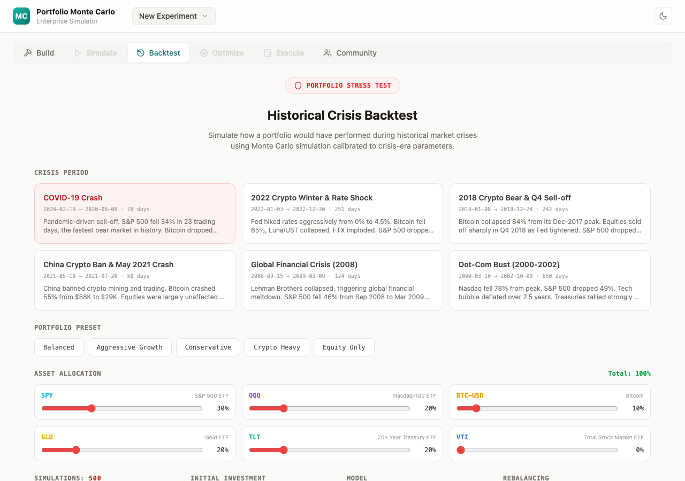

# Portfolio Monte Carlo Simulator

> Describe a portfolio in plain English. Simulate it. Stress-test it against historical crises. Optimize the weights. Execute the trades.

An AI-powered portfolio simulation platform built on Monte Carlo methods (GBM and Merton Jump Diffusion) with a tab-based workspace that auto-saves experiments.

<br>

## Screenshots

| Build | Simulate |
|-------|----------|
|  |  |

| Backtest | Optimize |
|----------|----------|
|  |  |

| Execute | Dark Mode |
|---------|-----------|
|  |  |

<br>

## Five Tabs. One Workspace.

| Tab | What it does |
|-----|-------------|
| **Build** | Describe goals in natural language. AI recommends assets with calibrated drift, volatility, and jump parameters. Edit everything. |
| **Simulate** | Run Monte Carlo (GBM or Merton Jump Diffusion). Fan charts, sample paths, VaR, CVaR, Sharpe, max drawdown. |
| **Backtest** | Stress-test against 6 historical crises (COVID-19, 2022 Crypto Winter, GFC 2008, Dot-Com, and more). |
| **Optimize** | Find optimal weights (max Sharpe, min VaR, min CVaR, min drawdown, max return). **Apply with one click.** |
| **Execute** | Connect Alpaca via OAuth. Generate trade list. Review. Submit orders. Paper or live. |

A persistent **portfolio bar** shows current allocations across all tabs. Switching tabs never destroys state.

**Portfolio experiments** auto-save to IndexedDB. Create, duplicate, rename, delete. Restored on reload.

<br>

## Quick Start

```bash
# Backend
cd backend
pip install -r requirements.txt   # or: poetry install
echo 'GEMINI_API_KEY=your-key' > .env   # optional — falls back to curated portfolios
uvicorn app.main:app --reload --port 8000

# Frontend
cd frontend
npm install && npm run dev
```

Open **http://localhost:5173**

<br>

## Architecture

```
Frontend (React 18 / TypeScript / Vite / Tailwind / Recharts)
  ├── Workspace: Build | Simulate | Backtest | Optimize | Execute
  ├── Portfolio Experiments: IndexedDB persistence
  └── Telemetry: sendBeacon → backend

Backend (Python 3.12 / FastAPI / single container)
  ├── contexts/intake/       → Gemini AI analysis
  ├── contexts/simulation/   → Monte Carlo, optimizer, backtest
  ├── contexts/insights/     → AI narrative generation
  ├── contexts/fulfill/      → Brokerage OAuth, trades, execution
  ├── contexts/observability/ → Request tracing, journey analytics
  └── engine/                → GBM, Merton Jump Diffusion, Cholesky correlation
```

Six bounded contexts. One container. Scale by cloning.

<br>

## Mathematical Models

**Geometric Brownian Motion**
```
S(t+dt) = S(t) * exp((mu - sigma^2/2) * dt + sigma * sqrt(dt) * Z)
```

**Merton Jump Diffusion**
```
dS/S = (mu - lambda*k)dt + sigma*dW + J*dN
```
Poisson jump arrivals. Log-normal jump sizes. Compensation term `k = exp(mu_J + sigma_J^2/2) - 1`.

**Correlation** via Cholesky decomposition of the NxN correlation matrix.

**Risk metrics**: VaR (95/99%), CVaR, Sharpe, Sortino, Calmar, Max Drawdown.

<br>

## Brokerage Integration

| Feature | Detail |
|---------|--------|
| **Providers** | Alpaca (live). IBKR (planned). Add a new broker = 1 file + 1 registry line. |
| **Auth** | OAuth flow. Tokens encrypted at rest (Fernet + SQLite). Never sent to frontend. |
| **Trade list** | Target allocations vs current holdings → buy/sell/hold with share quantities. |
| **Safety** | Default paper mode. Server-side `confirm: true` gate. PAPER/LIVE visual indicators. |

<br>

## Observability

Built-in request tracing + user journey analytics. Stored in SQLite, queryable via REST.

| Endpoint | What you learn |
|----------|---------------|
| `GET /api/obs/funnel` | Where users drop off |
| `GET /api/obs/timing` | P50/P95/P99 latency per endpoint |
| `GET /api/obs/journey/:session` | Full event timeline for one user |
| `GET /api/obs/bottlenecks` | Slowest endpoints |
| `GET /api/obs/drop-offs` | Highest abandonment rates |

Set `OTEL_EXPORTER_ENDPOINT` to ship to Jaeger, Grafana Tempo, or Datadog.

<br>

## Environment Variables

| Variable | Default | Description |
|----------|---------|-------------|
| `GEMINI_API_KEY` | — | Gemini AI key. Falls back to curated portfolios if unset. |
| `ALPACA_CLIENT_ID` | — | Alpaca OAuth client ID |
| `ALPACA_CLIENT_SECRET` | — | Alpaca OAuth client secret |
| `DEFAULT_TRADING_MODE` | `paper` | `paper` or `live` |
| `TOKEN_ENCRYPTION_KEY` | auto-gen | Fernet key for token encryption |
| `OTEL_EXPORTER_ENDPOINT` | — | OTLP collector for external telemetry |
| `VITE_API_URL` | `http://localhost:8000` | Backend URL (frontend) |

<br>

## Project Structure

```
backend/app/
├── contexts/
│   ├── intake/          POST /api/analyze-portfolio
│   ├── simulation/      POST /api/simulate, /optimize-weights, /backtest
│   ├── insights/        AI narrative generation
│   ├── fulfill/         OAuth, trade list, execute, order status
│   │   └── providers/   BrokerProvider ABC → Alpaca adapter
│   └── observability/   Request tracing, journey events, query endpoints
├── engine/              GBM, Merton, Cholesky, risk metrics, optimizer, backtest
└── models/              Pydantic schemas

frontend/src/
├── store/               IndexedDB experiments + useExperiment hook
├── components/          WorkspaceTabs, PortfolioBar, BuildTab, SimulateTab,
│                        OptimizeTab, BacktestTab, ExecuteTab, ThemeProvider
├── types/               TypeScript interfaces (portfolio + fulfill)
├── api.ts               API client with X-Session-ID
└── telemetry.ts         Fire-and-forget sendBeacon tracker
```

<br>

## Tech Stack

| Layer | Stack |
|-------|-------|
| **Frontend** | React 18, TypeScript, Vite, Tailwind CSS, Recharts, Lucide |
| **Backend** | Python 3.12, FastAPI, NumPy, SciPy, Pydantic |
| **AI** | Google Gemini (analysis + narrative generation) |
| **Brokerage** | httpx, cryptography (Fernet) |
| **Observability** | OpenTelemetry API/SDK, SQLite |
| **Storage** | IndexedDB (frontend), SQLite (backend telemetry + tokens) |

<br>

## License

MIT
