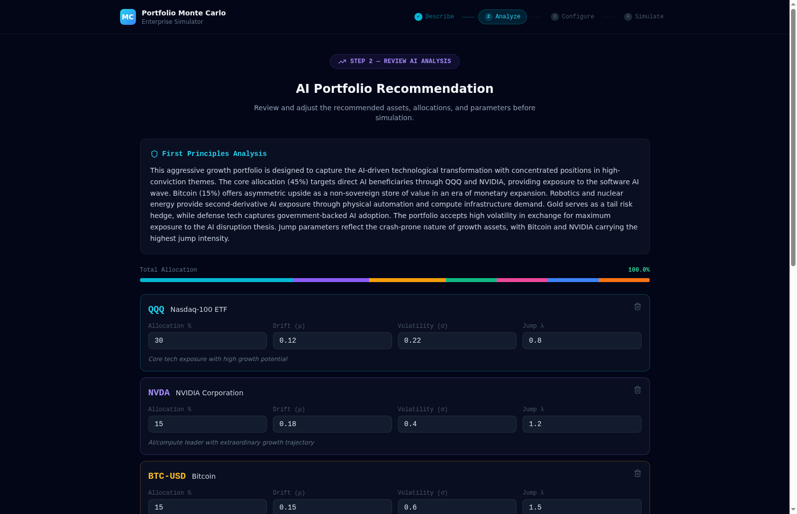
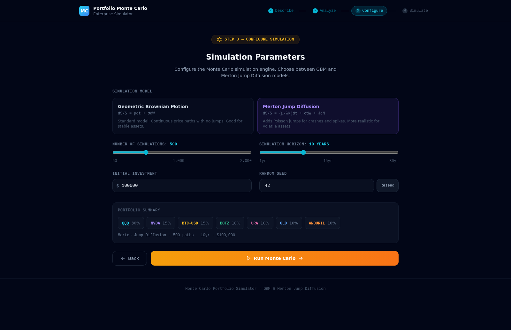
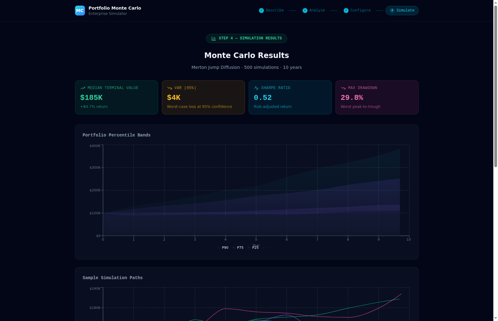
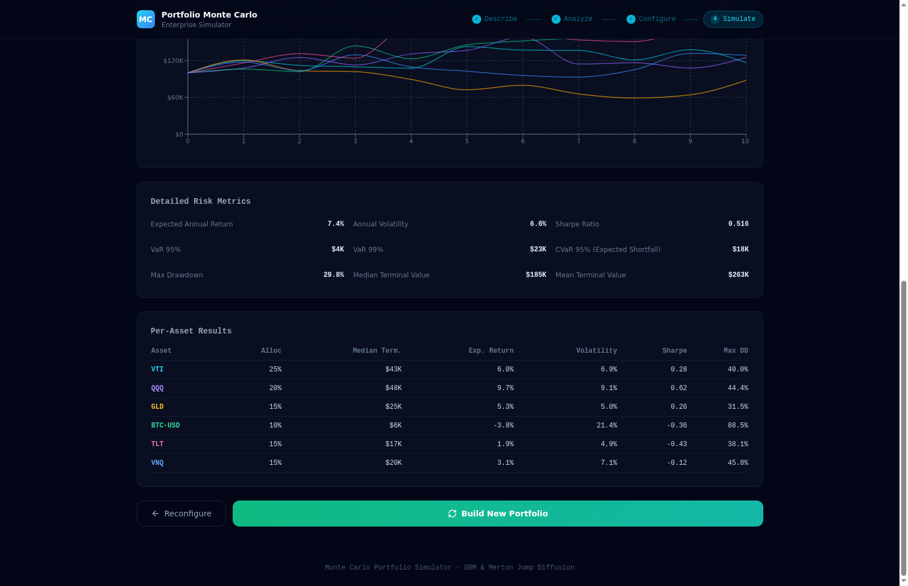

# Portfolio Monte Carlo Simulator

An enterprise-grade portfolio simulation platform that combines **AI-powered analysis** with **Monte Carlo methods** (GBM and Merton Jump Diffusion) to model portfolio outcomes across thousands of stochastic paths.

Users describe a portfolio in plain English, review AI-recommended assets with calibrated parameters, configure simulation settings, and visualize results through interactive percentile fan charts, sample paths, and comprehensive risk metrics.

---

## Screenshots

### Step 1 — Describe Your Portfolio
Describe your investment goals in natural language. Select risk tolerance and investment horizon. Choose from preset prompts or write your own.


### Step 2 — Review AI Analysis
AI analyzes your description and recommends specific assets with calibrated drift, volatility, and jump parameters. Edit allocations, add/remove assets, and review the first-principles rationale.



### Step 3 — Configure Simulation
Choose between Geometric Brownian Motion and Merton Jump Diffusion models. Set number of simulations (50-2000), horizon (1-30 years), initial investment, and random seed.



### Step 4 — Simulation Results
Interactive dashboard with key metrics (median terminal value, VaR, Sharpe ratio, max drawdown), percentile fan chart (P10/P25/median/P75/P90), sample simulation paths, detailed risk metrics table, and per-asset breakdown.




---

## Architecture

```
┌─────────────────────────────────────────────────────────┐
│                    React Frontend                        │
│  Step 1: Describe → Step 2: Analyze → Step 3: Configure │
│                    → Step 4: Simulate                    │
│  React 18 + TypeScript + Tailwind CSS + Recharts         │
└────────────────────────┬────────────────────────────────┘
                         │ HTTP (JSON)
                         ▼
┌─────────────────────────────────────────────────────────┐
│                   FastAPI Backend                         │
│  POST /api/analyze-portfolio  →  Gemini AI Analyzer      │
│  POST /api/simulate           →  Monte Carlo Engine      │
│                                                          │
│  NumPy + SciPy + google-genai                            │
└─────────────────────────────────────────────────────────┘
```

**Backend** — Python 3.12 / FastAPI. Two endpoints: portfolio analysis (Gemini AI with curated fallbacks) and Monte Carlo simulation (GBM + Merton Jump Diffusion with Cholesky-correlated assets).

**Frontend** — React 18 / TypeScript / Vite. 4-step wizard UI with editable parameters, interactive Recharts visualizations, and a dark enterprise theme built with Tailwind CSS.

---

## Key Features

- **Natural Language Portfolio Builder** — describe your portfolio in plain English; AI recommends assets with calibrated parameters
- **Geometric Brownian Motion (GBM)** — `S(t+dt) = S(t) * exp((mu - sigma^2/2)*dt + sigma*sqrt(dt)*Z)`
- **Merton Jump Diffusion** — `dS/S = (mu - lambda*k)dt + sigma*dW + J*dN` with Poisson jumps and log-normal jump sizes
- **Cholesky-Decomposed Correlation** — correlated Brownian motions across all assets via Cholesky factorization
- **Comprehensive Risk Metrics** — VaR (95%, 99%), CVaR (Expected Shortfall), Sharpe Ratio, Max Drawdown
- **Percentile Fan Charts** — P10, P25, Median, P75, P90 bands at annual intervals from monthly time steps
- **Per-Asset Breakdown** — individual asset results with allocation, terminal value, return, volatility, and drawdown
- **Configurable Parameters** — number of simulations, horizon, model type, initial investment, random seed
- **Editable Asset Allocations** — adjust drift, volatility, jump intensity, and allocation percentages before simulation
- **AI Fallback System** — 3 curated portfolio templates when Gemini API is unavailable

---

## Dependencies

### Backend (Python 3.12)

| Package | Version | Purpose |
|---------|---------|---------|
| `fastapi[standard]` | ^0.135.2 | Web framework with Uvicorn |
| `numpy` | ^2.4.3 | Monte Carlo simulation engine |
| `scipy` | ^1.17.1 | Statistical functions, Cholesky decomposition |
| `pydantic` | ^2.12.5 | Request/response validation |
| `google-genai` | ^1.68.0 | Gemini AI portfolio analysis |

### Frontend (Node.js)

| Package | Version | Purpose |
|---------|---------|---------|
| `react` | ^18.3.1 | UI framework |
| `react-dom` | ^18.3.1 | React DOM renderer |
| `typescript` | ~5.6.2 | Type safety |
| `vite` | ^6.0.1 | Build tool and dev server |
| `tailwindcss` | ^3.4.16 | Utility-first CSS |
| `recharts` | ^2.12.4 | Charts (fan chart, line chart) |
| `lucide-react` | ^0.364.0 | Icons |
| `class-variance-authority` | ^0.7.1 | Component variants |
| `clsx` | ^2.1.1 | Conditional classnames |
| `tailwind-merge` | ^3.5.0 | Tailwind class merging |

---

## Getting Started

### Prerequisites

- Python 3.12+
- [Poetry](https://python-poetry.org/docs/#installation) (Python package manager)
- Node.js 18+ and npm

### Backend Setup

```bash
cd backend

# Install dependencies
poetry install

# (Optional) Set Gemini API key for AI analysis
# Without it, the app uses curated fallback portfolios
export GEMINI_API_KEY="your-google-gemini-api-key"

# Start the backend server
poetry run uvicorn app.main:app --reload --port 8000
```

The API will be available at `http://localhost:8000`. API docs at `http://localhost:8000/docs`.

### Frontend Setup

```bash
cd frontend

# Install dependencies
npm install

# Start the dev server
npm run dev
```

The app will be available at `http://localhost:5173`.

### Environment Variables

| Variable | Location | Default | Description |
|----------|----------|---------|-------------|
| `GEMINI_API_KEY` | Backend | (none) | Google Gemini API key. Falls back to curated portfolios if unset |
| `VITE_API_URL` | Frontend | `http://localhost:8000` | Backend API URL |

---

## Deployment

### Firebase Hosting (Frontend) + Cloud Run (Backend)

**Frontend:**
```bash
cd frontend
npm run build
firebase init hosting  # public dir: dist, SPA: Yes
firebase deploy
```

**Backend:**
```bash
cd backend
gcloud run deploy portfolio-mc-api \
  --source . \
  --region us-central1 \
  --allow-unauthenticated \
  --set-env-vars GEMINI_API_KEY=your-key
```

Update the frontend's `VITE_API_URL` to point to your Cloud Run URL before building.

---

## Project Structure

```
ai-disruption-mc/
├── backend/
│   ├── app/
│   │   ├── main.py                  # FastAPI app + CORS
│   │   ├── api/
│   │   │   └── routes.py            # /api/analyze-portfolio, /api/simulate
│   │   ├── engine/
│   │   │   ├── analyzer.py          # Gemini AI portfolio analyzer + fallbacks
│   │   │   └── monte_carlo.py       # GBM, Merton Jump Diffusion, risk metrics
│   │   └── models/
│   │       └── schemas.py           # Pydantic request/response models
│   ├── pyproject.toml               # Poetry dependencies
│   └── README.md
├── frontend/
│   ├── src/
│   │   ├── App.tsx                  # 4-step wizard state machine
│   │   ├── api.ts                   # Backend API client
│   │   ├── types/
│   │   │   └── portfolio.ts         # TypeScript type definitions
│   │   └── components/
│   │       ├── PortfolioDescriber.tsx   # Step 1: natural language input
│   │       ├── AnalysisReview.tsx       # Step 2: AI recommendations
│   │       ├── SimulationConfig.tsx     # Step 3: model & parameters
│   │       └── SimulationDashboard.tsx  # Step 4: charts & metrics
│   ├── package.json
│   ├── tailwind.config.js
│   ├── vite.config.ts
│   └── README.md
├── docs/                            # Screenshots
└── README.md
```

---

## Mathematical Models

### Geometric Brownian Motion (GBM)

```
S(t+dt) = S(t) * exp((mu - sigma^2/2) * dt + sigma * sqrt(dt) * Z)
```

Where `mu` is drift (expected return), `sigma` is volatility, `dt = 1/12` (monthly steps), and `Z ~ N(0,1)`.

### Merton Jump Diffusion

```
dS/S = (mu - lambda*k)dt + sigma*dW + J*dN
```

Where `N ~ Poisson(lambda)` governs jump arrivals, `J ~ LogNormal(mu_J, sigma_J)` governs jump sizes, and `k = exp(mu_J + sigma_J^2/2) - 1` is the jump compensation term.

### Correlation

Asset paths are correlated via **Cholesky decomposition** of the correlation matrix, producing correlated Brownian motions across all assets in the portfolio.

### Risk Metrics

- **VaR (Value at Risk)** — dollar loss at 95th/99th percentile of the loss distribution
- **CVaR (Conditional VaR)** — expected loss beyond VaR (tail risk measure)
- **Sharpe Ratio** — `(E[r] - r_f) / sigma` with `r_f = 4%`
- **Max Drawdown** — worst peak-to-trough decline averaged across all paths

---

## License

MIT
